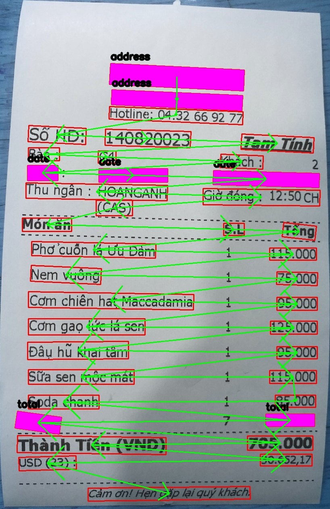
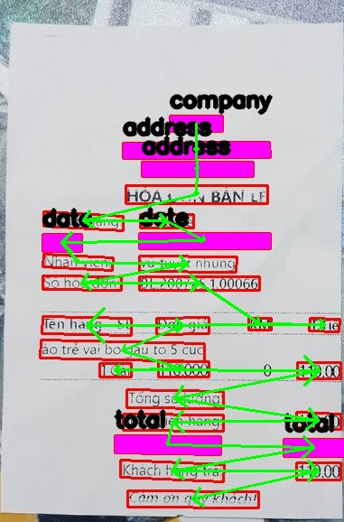

# Key information extraction using graph convolution neural network
## requirement
* craft-text-detector  0.3.1 
* dgl-cuda10.1         0.5.3
* opencv-python        3.4.8.29 
* vietocr              0.3.5
* pytorch              1.7.1
## RUN PREDICT MODEL
* app.py (change image path)
## Train model
* Create data set format (x1,y1,...,x4,y4, ocr parser, label class.
* Run GRAPH_MODEL train.py (set parameter in this file)
## Visualize image predict

## Reference
* https://github.com/cyh1112/GraphNormalization
* https://github.com/eragonruan/text-detection-ctpn
* https://github.com/graphdeeplearning/benchmarking-gnns
