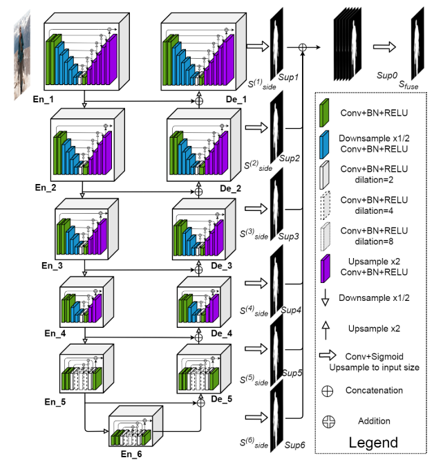
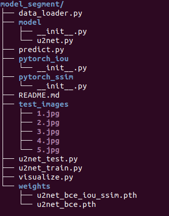

# Model segment U^2 
# Requirement
* pytorch 
* torchvision == 0.5.0 
* pytorch  >= 1.4.0
# 1. Model architecture
* Detail : https://docs.google.com/presentation/d/1Sjyvm1xb2yUkpsL-9l4SKmKkDRPRyiJlhM0eevhYRas/edit#slide=id.g906421739f_0_0
* 
# 2. Training
- Model : Unet^2 with loss BCE + IOU + SSIM 
- Augmentation : Horizontal flip, replace background
- Model parameter : Image size 320, RGB color (can change to HSV or YCYCB), optimizer Adam, epoch 100, batch-size 6.
# 3. Structure project
*  
* Model : u2net.py
* Dataloader : dataloader.py
* Loss : pytorch_iou and pytorch_ssim
* Train : u2net_train.py
* Weight : 2 option only loss binary cross entropy and 3 loss BCE + IOU + SSIM 
* Inference : predict.py
 
# Reference
* U2-Net: Going Deeper with Nested U-Structure for Salient Object Detection Xuebin
* BASNet: Boundary-Aware Salient Object Detection Xuebin

